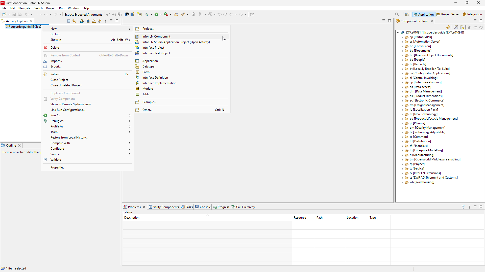

# 1. Tables and domains

First table, session and report in **INFOR LN**.

### Table

First we are going to create table, based od this scheme.

#### 1. Right click activity → New → Infor LN Component

#### 2. Choose component type "Table" and click next

#### 3. Enter table name and descrption as "Items" then click Finish

:::info

We using package tx and module zpl (polish extension) which is reserved for us. You can use whatever module and code you need.
Table number should be beetween 000-999. In our case we pick 400 so it makes "txzpl400".

:::

## Table Fields
### Domains

:::note

Domain is defined datatype. It is applicable to fields and variables.

:::

#### 1. Add table field

#### 2. It will ask if you want to check-out component. Click yes

:::info

If you want to modify component within activity you need to check-out component first.
Check-in if you finish your modifications.

:::

#### 3. Now click Add once more. We need to enter fields Name, Label and Domain

:::tip

You can you first 4 letters of table field name as field name ID → .iden or make it smoother like Order Number → .orno , 
it will be more natural as you start working with LN.

:::

#### 4. Click Browse...

#### 5. Now click New

:::info

Labels are codes that are used instead of language-dependent text in
forms, reports, domains, and menus. We want

:::

#### 6. Fill Name and Description

:::tip

Best practice is naming label as table fields which they are aplied to.

:::

#### 7. It will ask you if you want to create new label with same description.

:::warning

Best practice is use already defined labels to not making tons of same 'ID's and other common used labels. However for this tutorial we are going to create them to show process.

:::

#### 8. Click Browse...

#### 9. Now click New

#### 10. Now enter data based on table diagram

