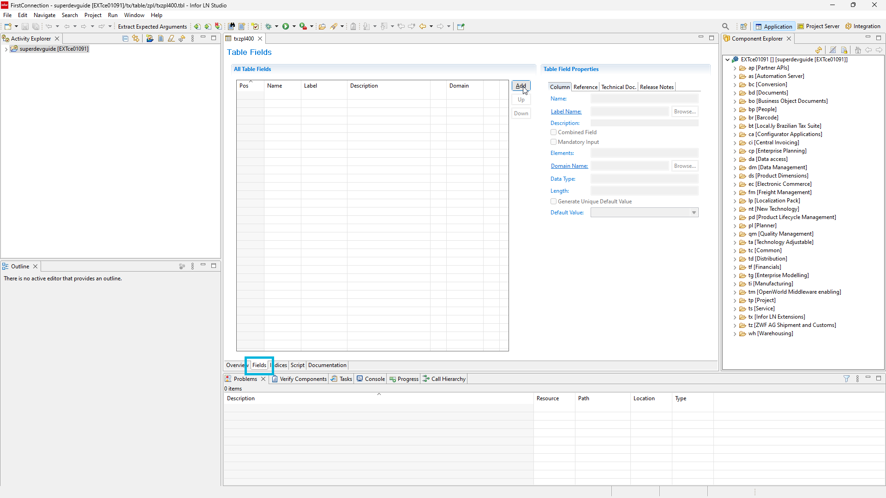

# 2. Sessions

First table, session and report in **INFOR LN**.

## Table

First we are going to create table, based od this scheme.


#### 1. Right click activity → New → Infor LN Component


#### 2. Choose component type "Table" and click next


#### 3. Enter table name and descrption as "Items" then click Finish

:::info

We using package tx and module zpl (polish extension) which is reserved for us. You can use whatever module and code you need.
Table number should be beetween 000-999. In our case we pick 400 so it makes "txzpl400"

:::


#### 4. 



## Generate a new site

Generate a new Docusaurus site using the **classic template**.

The classic template will automatically be added to your project after you run the command:

```bash
npm init docusaurus@latest my-website classic
```

You can type this command into Command Prompt, Powershell, Terminal, or any other integrated terminal of your code editor.

The command also installs all necessary dependencies you need to run Docusaurus.

## Start your site

Run the development server:

```bash
cd my-website
npm run start
```

The `cd` command changes the directory you're working with. In order to work with your newly created Docusaurus site, you'll need to navigate the terminal there.

The `npm run start` command builds your website locally and serves it through a development server, ready for you to view at http://localhost:3000/.

Open `docs/intro.md` (this page) and edit some lines: the site **reloads automatically** and displays your changes.
