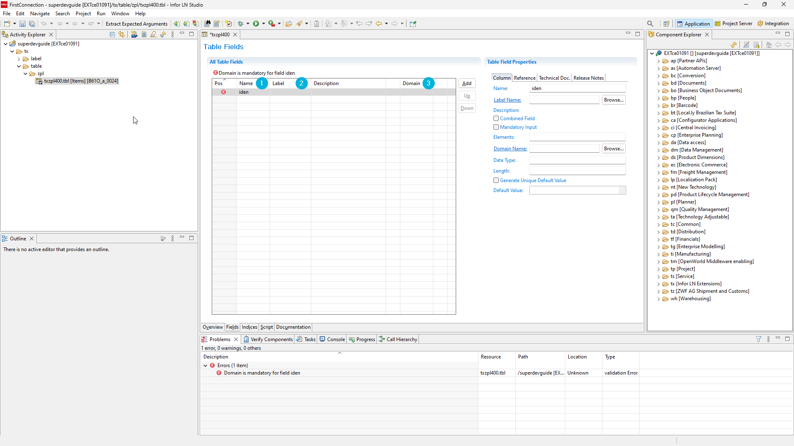
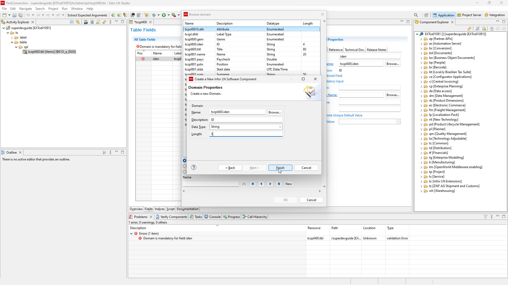

# 8. Comming soon...

First table, session and report in **INFOR LN**.

### Table

First we are going to create table, based od this scheme.

#### 1. Right click activity → New → Infor LN Component.

#### 2. Choose component type "Table" and click next.

#### 3. Enter table name and descrption as "Items" then click Finish.

:::info

We using package tx and module zpl (polish extension) which is reserved for us. You can use whatever module and code you need.
Table number should be beetween 000-999. In our case we pick 400 so it makes "txzpl400".

:::

## Table Fields
### Domains

:::note

Domain is defined datatype. It is applicable to fields and variables.

:::

#### 4. Add table field

#### 5. It will ask if you want to check-out component. Click yes.

:::info

If you want to modify component within activity you need to check-out component first.
Check-in if you finish your modifications.

:::

#### 6. Now click Add once more. We need to enter fields Name, Label and Domain.

### Labels

:::note

Label is language based component. Example: label tcibd.item appears in english as 'Item' and in polish as 'Pozycja'.

:::
:::tip

You can you first 4 letters of table field name as field name ID → .iden or make it smoother like Order Number → .orno , 
it will be more natural as you start working with LN.

:::

#### 7. Click Browse...

#### 8. Now click New.

:::info

Labels are codes that are used instead of language-dependent text in
forms, reports, domains, and menus. We want

:::

#### 9. Fill Name and Description.

:::tip

Best practice is naming label as table fields which they are aplied to.

:::

#### 10. It will ask you if you want to create new label with same description.

:::warning

Best practice is use already defined labels to not making tons of same 'ID's and other common used labels. However for this tutorial we are going to create them to show process.

:::

#### 11. Click Browse...

#### 12. Now click New.

#### 13. Now enter data based on table diagram.

#### 14. Here is how we create enumerated field.

#### 15. We go to our domain (1) then on 'Enum - Set Data' (2). Let's set our Step size = 1 (3) and Add (4).
:::info

Step size is constant step for enum. It's usually 10 for LN enums.

:::

#### 16. Enter rest of enum data.

#### 17. Set default value for enum field in table.

#### 18. Finish table, set 'Creation Date' domain as date and 'Last Modification Date' domain as UTC/TIME.

#### 19. Check in our changes.
:::info

Every component we modify we first check-out, then we modify it and last we check-in it.
Check-in and Check-out allows only one user to modify object, so developers don't colide.

:::

#### 20. Now Enter commit message.

### Indices
:::info

Index allows us to retrive table faster and guarantee record uniqueness. Table requires at least one index.

:::
#### 21. We overlook creating index for table. Go to 'Indices' tab (1) and add index as on screen.

#### 22. Now 'Active' and 'Unique' checkbox are marked.

#### 23. We need to check-in our changes once again.

#### 24. Now we right click on activity to end it.

#### 25. Make sure checkbox 'Close activity' is unmarked and click 'OK'.
:::warning

If you close actvity you need to create new one.

:::

#### 26. Here are displayed errors for ending activity.

### Admin mode

#### 27. To create table we need to turn on admin mode. Go to LN and run session 'ttmtm3501m000'. Turn admin mode on and set maintenance mode. It will take a while.
:::danger

Turning on active mode logout all non superusers, stops all jobs that are running on normal user. Make sure you can turn it on and turn it off when You finish.

:::

#### 28. Now go to session ttadv5215m000 and convert. Specify options as on screen. We usually want to convert all in case other developers forget to convert their work.

#### 29. Now go to session ttadv1243m000 and compile. Specify options as on screen. We usually want to compile all in case other developers forget to convert their work.

#### 30. You can also convert and create from LN Studio.

#### 31. Convert.

#### 32. Now create table. In example we use company 2100.

#### 33. Create tables session in LN is 'ttaad4230m000'.

#### 34. Remember to turn off admin mode.

#### 35. You can look at new created table in session ttaad4100.

## TO DO 

Create Tables based on schemes.
Role enum should have 'Buyer' and 'Seller'.

